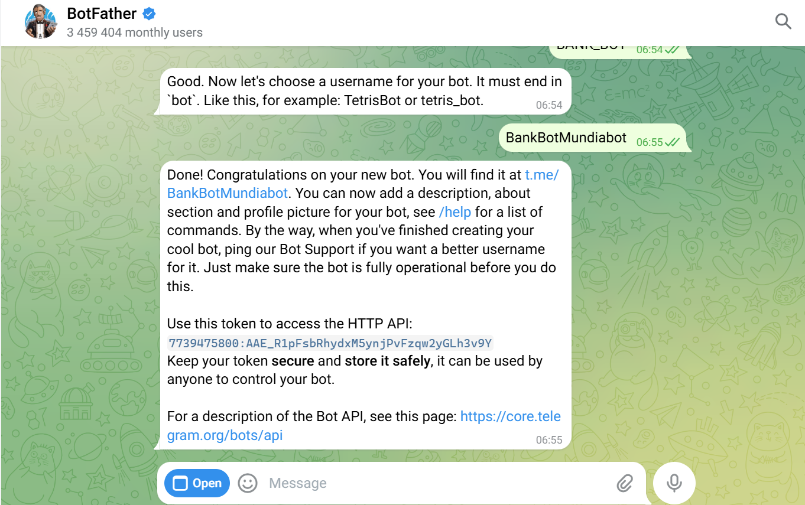

# Banque Digitale Mundiapolis

## Description
Solution bancaire digitale complète avec backend Spring Boot, frontend Angular, et bot Telegram intégré à une IA pour interaction utilisateur.



## Table des matières
1. [Présentation du projet](#présentation-du-projet)
2. [Fonctionnalités principales](#fonctionnalités-principales)
3. [Stack technique](#stack-technique)
4. [Architecture globale](#architecture-globale)
5. [Backend](#backend)
6. [Frontend](#frontend)
7. [Bot Telegram & IA](#bot-telegram--ia)
8. [Sécurité](#sécurité)
9. [Installation et démarrage rapide](#installation-et-démarrage-rapide)
10. [Captures d'écran](#captures-décran)
11. [Contribution](#contribution)
12. [Crédits](#crédits)
13. [Licence](#licence)

## Présentation du projet
Projet de banque digitale permettant la gestion des clients, comptes bancaires, opérations financières et interaction via bot Telegram.

## Fonctionnalités principales
- Authentification JWT stateless et gestion des rôles ADMIN/USER
- Gestion des clients : recherche, ajout, modification, suppression
- Comptes bancaires : Courant et Épargne, consultation solde
- Opérations financières : Débit, Crédit, Virement
- Historique des opérations
- Bot Telegram connecté à l'IA pour consultation et questions financières

## Stack technique
**Backend:** Java 17, Spring Boot 3, Spring Data JPA, MySQL, Spring Security, JWT

**Frontend:** Angular 17+, TypeScript, Bootstrap 5, RxJS

**Bot & IA:** Telegram Bots API, OpenAI GPT

**Outils:** Maven, Node.js v18+, NPM

## Architecture globale
- **Frontend:** SPA Angular communiquant via REST
- **Backend:** API Spring Boot exposant endpoints REST sécurisés
- **Base de données:** MySQL
- **Bot:** Bot Telegram connecté à OpenAI GPT

## Backend
### Endpoints principaux
| Path | Méthode | Description |
|------|---------|-------------|
| /auth/login | POST | Authentification et génération du JWT |
| /auth/profile | GET | Récupération du profil utilisateur |
| /customers | GET/POST/PUT/DELETE | Gestion des clients |
| /accounts | GET/POST | Gestion des comptes |
| /operations | GET/POST | Gestion des opérations |

## Frontend
Pages principales:
- Login
- Accueil
- Gestion des clients
- Comptes et opérations
- Transferts

## Bot Telegram & IA
Fonctionnalités:
- Lier compte bancaire via /link
- Obtenir solde et dernières opérations
- Conversation contextuelle via IA

## Sécurité
- JWT pour auth stateless
- Spring Security pour rôles et permissions
- Mots de passe hashés avec BCrypt
- CORS configuré pour frontend

## Installation et démarrage rapide
### Prérequis
- Java 17+
- Node.js v18+
- NPM
- MySQL
- Maven

### Backend
```bash
cd backend
mvn spring-boot:run
```

### Frontend
```bash
cd frontend
npm install
ng serve
```

### URLs
- Backend: [http://localhost:8085](http://localhost:8085)
- Frontend: [http://localhost:4200](http://localhost:4200)

## Captures d'écran
- login_page.png
- home_page.png
- customers_page.png
- accounts_page.png
- transfer_page.png

## Contribution
Forker le projet, créer une branche, puis soumettre une Pull Request.

## Crédits
- Auteur: Idriss Chadili
- Superviseur: Pr. Mohamed Youssfi

## Licence
Freeware